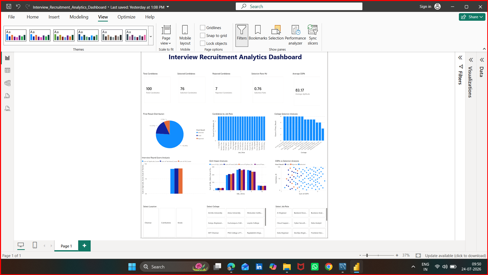

# Interview-Recruitment-Analytics-Dashboard

# Interview Recruitment Analytics Dashboard

## Project Overview

The Interview Recruitment Analytics Dashboard is an end-to-end data analytics project developed using MySQL, Microsoft Excel, and Power BI. The project analyzes the complete recruitment process, helping recruiters understand candidate performance, selection trends, interview outcomes, and skill distribution through interactive dashboards.

---

## Objectives

- Analyze candidate recruitment data.
- Track selected and rejected candidates.
- Measure interview performance.
- Compare candidate skills.
- Analyze college-wise recruitment.
- Support recruitment decision-making through interactive visualizations.

---

## Tools & Technologies

| Tool | Purpose |
|------|---------|
| MySQL | Database creation and SQL queries |
| Microsoft Excel | Data preparation and cleaning |
| Power BI | Dashboard development and visualization |

---

## Database Tables

### 1. Job_Details

| Column |
|---------|
| Job_ID |
| Job_Role |
| Department |
| Location |

---

### 2. Candidate_Details

| Column |
|---------|
| Candidate_ID |
| Candidate_Name |
| College |
| Location |
| CGPA |
| Job_ID |

---

### 3. Candidate_Skills

| Column |
|---------|
| Candidate_ID |
| SQL_Skills |
| Python_Skills |
| Excel_Skills |
| PowerBI_Skills |
| Communication_Skills |
| ProblemSolving_Skills |

---

### 4. Interview_Results

| Column |
|---------|
| Candidate_ID |
| Aptitude_Score |
| Technical_Score |
| HR_Score |
| Final_Result |

---

## Dashboard KPIs

- Total Candidates
- Selected Candidates
- Rejected Candidates
- Selection Rate (%)
- Average CGPA

---

## Dashboard Visualizations

- Final Result Distribution (Pie Chart)
- Candidates by Job Role (Bar Chart)
- College-wise Selection Analysis
- Skill Comparison Analysis
- Interview Score Analysis
- CGPA vs Selection Analysis

---

## Interactive Filters

- Job Role
- College
- Location

---

## Key Insights

- Identifies colleges with better recruitment performance.
- Compares candidate skill levels.
- Tracks interview round performance.
- Measures overall recruitment success rate.
- Supports data-driven hiring decisions.

---

## Project Folder Structure

```
Interview Recruitment Analytics
│
├── Dataset
├── Excel
├── Images
├── Power BI
└── SQL
```

---

## Dashboard Preview



---

## Author

**Mayuri T**

B.Tech Information Technology

Power BI | SQL | Excel | Python | Data Analytics
